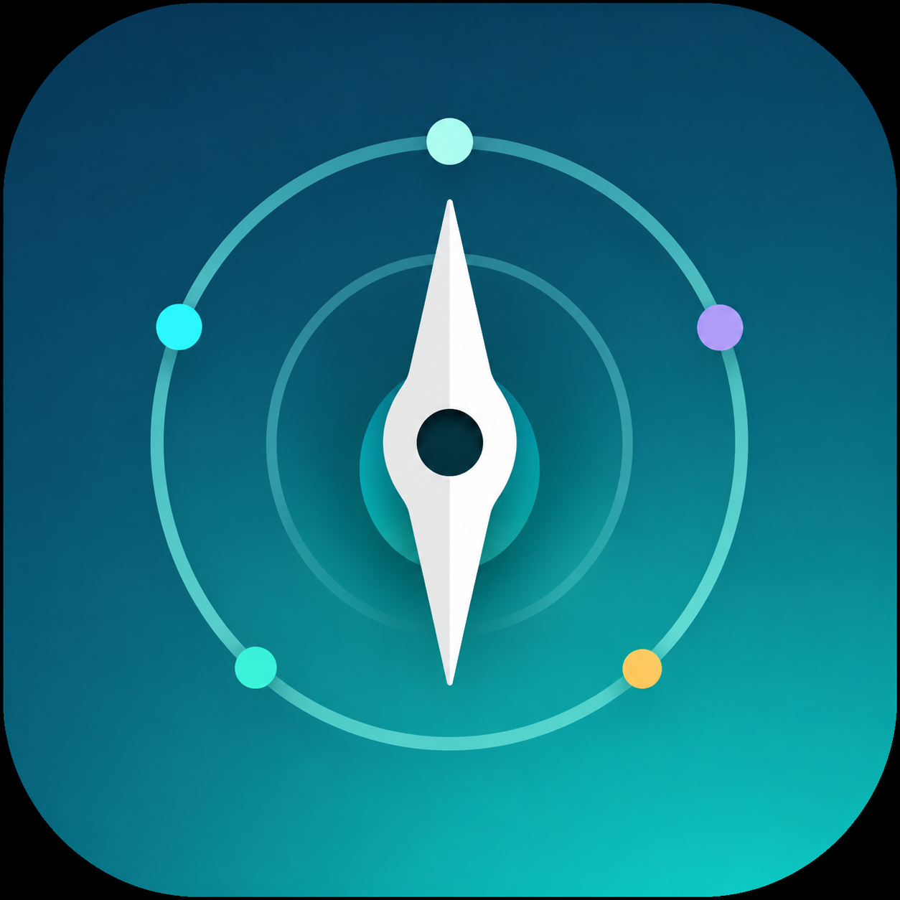

# Recovery Compass



**Recovery Compass v1.0** is a privacy-conscious student reflection app for recording a small daily set of training, sleep, optional mood, and study information, then turning those records into transparent seven-day patterns.

The product is deliberately designed around factual self-tracking rather than medical judgment, gamification pressure, or a proprietary recovery score.

**Release status:** v1.0 release candidate. Internal qualification and fresh-eyes usability testing are complete. Public deployment verification is the remaining release step.

## For Portfolio / Admissions Reviewers

Recovery Compass is a **student-built, AI-assisted software product developed from problem definition through public v1.0 release**. The creator served as **Creator and Product Lead**, defining the product scope, user experience, data/privacy model, acceptance criteria, testing strategy, and release decisions. AI was used extensively as a technical development tool for instruction, implementation support, debugging, UI/UX iteration, testing, and documentation, rather than representing the project as independently hand-coded.

For a quick review of the project:

- **Try the product:** the public URL will be added here after deployment and clean-browser verification.
- **See what was built and how it works:** continue through this README.
- **See how the product evolved:** [`docs/engineering-journal.md`](docs/engineering-journal.md).
- **See how it was tested:** [`docs/testing.md`](docs/testing.md).
- **See exactly how AI was used:** [`docs/ai-assistance-log.md`](docs/ai-assistance-log.md).
- **See the original product constraints:** [`docs/product_spec_v0_1.md`](docs/product_spec_v0_1.md) and [`docs/data_schema_v0_1.md`](docs/data_schema_v0_1.md).
- **See the final v1.0 release summary:** [`RELEASE_NOTES.md`](RELEASE_NOTES.md).

As a portfolio artifact, the project demonstrates product scoping, iterative interface design, deterministic analytics, validation and data-integrity rules, privacy-conscious browser storage, usability testing, release qualification, and the ability to critically accept, reject, test, and verify AI-assisted technical work.

## What Recovery Compass Does

Recovery Compass provides five main areas:

- **Home** — a seven-day overview with coverage, period averages, domain cards, and a plain-language factual summary.
- **Log a Day** — a guided daily check-in with separate Rest and Workout behavior, live review, validation, and one saved record per calendar day.
- **Insights** — focused Sleep & Mood, Training, Study, recent-record, and complete-period comparison views.
- **Data & Backup** — portable CSV backup and restore between browser profiles or devices.
- **Help** — persistent explanations of the data model, metrics, colors, storage behavior, limitations, and a replayable quick tour.

The first visit also includes a short four-step guided tour that mirrors the real Home, Log, Insights, and Backup experience.

## Daily Record

Each saved day contains:

| Field | v1.0 behavior |
| --- | --- |
| Date | One real calendar date in `YYYY-MM-DD` form |
| Workout type | Rest, Strength, Cardio, Sport, Mobility, or Other |
| Workout duration | Whole minutes from 0–300 |
| Perceived exertion | Workout days: whole number 1–10. Rest days: stored automatically as 0 |
| Previous night's sleep | 0–16 hours; represents the main sleep period that ended on the selected date |
| Mood | Optional 1–5 rating; missing Mood remains missing rather than becoming zero |
| Study | 0–16 hours |

For the cleanest record, log near the **end of the selected day**, once training and study are mostly finished. For example, a September 4 entry uses the main sleep period from the night of September 3 into the morning of September 4.

## How the Seven-Day View Works

Home and Insights use a rolling seven-day period ending on the current date.

- Missing days stay missing. Recovery Compass does not invent zeroes for days that were never recorded.
- Sleep, Mood, and Study cards show averages from the values actually recorded.
- Training on Home shows **average workout duration across actual Workout days only**. Total workout minutes remain available as supporting context and in Insights.
- Rest days remain distinct from Workout days.
- A previous-period comparison unlocks only when both consecutive seven-day periods contain all seven recorded days.
- Comparison language is factual. Changes are not automatically labeled good or bad.

## Data Storage and Privacy

Recovery Compass v1.0 does **not** require an account, authentication, or a Recovery Compass cloud database.

The persistent copy of a user's records is stored in that browser/profile using browser-local storage. While the web app is open, Streamlit also holds the active runtime representation needed to operate the interface. Recovery Compass does not intentionally persist those records to a project account database.

Important consequences:

- refreshing the page or closing and reopening the tab should preserve records in the same browser/profile;
- a different browser/profile starts with its own separate local history;
- clearing browser/site data can remove locally stored records;
- there is no automatic cross-device synchronization;
- downloaded CSV backups are the user's portable copy and should be stored somewhere they can find later.

Recovery Compass intentionally avoids collecting unrestricted health journals, medical diagnoses, nutrition/calorie data, body-weight data, grades, school names, or other unrelated personal details.

## Backup and Restore

Use **Data & Backup → Download backup** to create `recovery_compass_backup.csv` containing the current validated history.

To move data to another browser or device, open Recovery Compass there and use **Restore backup**.

Restore is deliberately conservative:

- the whole CSV is validated before existing records change;
- malformed or schema-incompatible files are rejected;
- if any incoming date already exists, the restore is rejected rather than partially importing records;
- current records remain unchanged after a failed restore.

## Known v1.0 Limitations

Recovery Compass v1.0 is intentionally bounded.

- Saved records are **append-only** in the public interface. There is no edit/delete workflow yet.
- Only one saved record is allowed per calendar date. Duplicate dates are rejected.
- Browser/site-data clearing can remove records unless the user has downloaded a backup.
- There is no account, cloud sync, automatic device transfer, reminder system, or mobile-native application.
- Weekly comparison requires two consecutive complete seven-day periods.
- Workout categories are fixed rather than user-defined.
- Study remains a required field for the current student-focused v1.0 model.
- Recovery Compass does not provide medical diagnosis, treatment advice, injury assessment, mental-health assessment, causal claims, performance prediction, a recovery score, or automatic training prescriptions.
- v1.0 does not include user-set weekly goals or live AI coaching.
- The application has been extensively project-tested but has not undergone professional security, clinical, or production-scale audit.

## Post-v1.0 Directions

Fresh-eyes release testing identified two especially useful future directions without changing the v1.0 scope:

1. **Optional user-defined weekly intentions/goals** that remain neutral and user-controlled rather than prescriptive or gamified.
2. **Richer deterministic feedback** that returns more useful observations from the user's own data without pretending to diagnose, predict, or prove causation.

Edit/delete support also remains a deliberate post-v1.0 product decision because safe record mutation requires separate destructive-action, duplicate-date, backup, and recovery testing.

## Run Locally

The qualified development environment used Python 3.13 with the pinned packages in `requirements.txt`.

### Windows PowerShell

```powershell
python -m venv .venv
.\.venv\Scripts\Activate.ps1
python -m pip install -r requirements.txt
python -m streamlit run app.py
```

### macOS / Linux

```bash
python3 -m venv .venv
source .venv/bin/activate
python -m pip install -r requirements.txt
python -m streamlit run app.py
```

The app normally becomes available at `http://localhost:8501`.

## Qualification Commands

The v1.0 release candidate is checked with:

```powershell
python -m pytest -q
python -m py_compile app.py src\validation.py src\storage.py src\analytics.py src\feedback.py
git diff --check
```

Final local release qualification on September 4, 2026 produced:

```text
26 passed
Python compilation: PASS
git diff --check: PASS (exit code 0)
Internal smoke regression: PASS
Fresh-eyes usability test: PASS
Known release blockers: 0
```

Normal Git LF/CRLF working-copy warnings on Windows are not a failed whitespace check when `git diff --check` returns exit code `0`.

## Repository Structure

```text
app.py                         Streamlit product interface
assets/                        Recovery Compass visual assets and CSS
src/validation.py              Shared validation and normalization
src/storage.py                 CSV validation/import/export/storage contract
src/analytics.py               Deterministic seven-day calculations
src/feedback.py                Factual deterministic observations
tests/                         Automated and manual qualification scripts
docs/engineering-journal.md    Development decisions and iteration history
docs/testing.md                Qualification evidence
docs/ai-assistance-log.md      AI-assistance disclosure and verification record
docs/product_spec_v0_1.md      Original frozen MVP specification + final addendum
docs/data_schema_v0_1.md       Original frozen data schema + final addendum
RELEASE_NOTES.md               v1.0 release summary and known limits
```

`data/recovery_compass.csv`, `.venv/`, caches, secrets, and private local data are excluded from the intended repository runtime/public-data model.

## AI-Assisted Development Disclosure

Recovery Compass is an **AI-assisted Python product-development project**.

AI was used extensively for technical instruction, architecture, code drafting and revision, debugging, UI/UX iteration, test design, release qualification planning, and documentation support. The project does not claim that all implementation code was independently written without AI assistance.

The creator served as **Creator and Product Lead** and remained responsible for product scope, user research, product decisions, acceptance/rejection of proposed changes, local execution, manual testing, automated-test execution, fresh-eyes testing, visual qualification, defect classification, privacy/limitations decisions, and final release acceptance.

Detailed chronological disclosure is maintained in [`docs/ai-assistance-log.md`](docs/ai-assistance-log.md).

## Release Evidence

See:

- [`docs/testing.md`](docs/testing.md) for automated, manual, browser-persistence, release-state, and fresh-eyes qualification evidence.
- [`docs/engineering-journal.md`](docs/engineering-journal.md) for architecture and product decisions.
- [`RELEASE_NOTES.md`](RELEASE_NOTES.md) for the v1.0 release summary.
